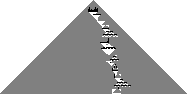

# 14 &ndash; Falling sand game
I lost a bit of time here at the beginning by changing my mind about what data structure to use... at first I started building the code around storing the state of the grid in a big 2D array, but then ultimately realised that the pile of sand could, and indeed probably would, stretch somewhat above the top of the initial bounds of the array... and I really didn't want to dynamically resize the list (and have to maintain all the bounds details). So I rewrote it to use a `dict` keyed by an x,y pair instead. I could've just made it a `set` of points, but I kinda had this thought that maybe the second part of the puzzle would involve knowing the difference between a wall and a grain of sand, so I kept track of that in the `dict`. That didn't end up being the case, but it was simple enough to do (and would have been painful enough to retrofit if I didn't do it) that I still think it was the right play. For the Haskell re-implementation, with the power of foresight knowing what the second part is going to be, I implemented it using a `Set` from the beginning.

Other than that hiccup though, this one was pretty smooth sailing, just directly implementing the path of the sand and simulating each one. Even for part 2. It really does feel like we're getting close to the point in the month where part 2's will be going from "just do it more" to "do it so much more that you need a more efficient solution"... but we're not there yet.

Also, because I was curious, I did draw some images of how the final sand piles look for each part:

 

[134/94]
