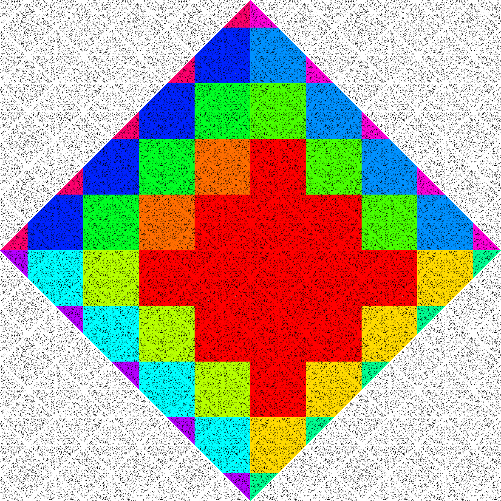

# 21 &ndash; Tiptoe Through the Infinite Tulips
Oof. Oooooof.

OK.

So, part 1. Not a lot to talk about in part 1. Just have to realise that we can essentially reach any cell that's within the distance and is an even distance away (because we're stuck to the grid, which means there's no way to leave a space and then return to that space in an odd number of steps). Run the pathfinding, get the counts for each space, see how many qualify, bing bang bong all done.

Part 2, though. Obviously far too big to analyse directly. We need to make use of the fact that it's periodic.

However, a clue! While this is _not_ true of the sample grid in the puzzle, for the actual input, the `S` start position is in a _completely empty_ row and column. This makes things a lot easier! No matter how complicated the pathfinding in the actual maze itself is, we have a _straight shot_ to the next repetition of the maze.

This, in turn, means that each repetition of the maze, we know we will first appropach from one of the four corners, and we will then rapidly be able to run around the outside and enter from any angle, so no other approach vector from outside that square matters, just how quickly we can get to the nearest corner, which we have a straight shot to.

So first, we rotate the maze around so that our start location is in the top-left corner, and the rest of the grid is a single contiguous copy of a square of the maze, surrounded by a square of path. Then, we imagine an infinite grid of copies of those squares, and they can be _classified_ by (a) which corner is closest to the start location (ie the top-left corner of the centre square), and (b) how far it is away (by taxicab). Each square with the same classification will have _the same_ coverage ability.

Above that... all the squares that are close enough will have _complete_ coverage, so they will all be the same regardless of distance (or, rather, the odd-distanced ones will all be the same, and the even-distanced ones will all be the same). Meanwhile, all squares that are far enough away will have zero coverage (just can't get there in time). There is only a small fringe between these where we care, which only covers a small handful of those classification categories.

The end result looks something like this (for a much smaller maximum distance):



On this image, the red tiles are within the radius where we can guarantee full coverage. We then have to go three tiles further in each direction, to reach the edge of our reach.

In theory, some of this work to determine the classifications could have been done automatically, but with only three tiles in each of 4 directions meaning 12 tile types to care about, I just did it all by hand. I labelled each of the tiles `A` through `L`, and separately wrote the code to determine (a) how many cells are reachable in that tile, and (b) how many copies of that tile are on the grid.

As it happens, we also have full coverage over the orange and green tiles in the upper left, the green tiles in the upper right, and the yellow tiles in the lower right... but that's fine, treating these groups separately won't change the answer. It's a bit of extra work which isn't needed, but that's fine. Similarly, the third tile group in the lower right is completely unreachable, but that's not a problem for the same reason.

What's less fine is that I said we need to go three tiles further in each direction, but to the upper left we actually need to go _four_ additional tiles (orange, green, blue, and pink). Realising this was needed, and trying to bolt it on as an extra tile to care about, quite late in the process, did end up making the code a bit more of a mess. In particular, this new tile should have gone _before_ tile `A`, so now the code has an `A_` as a thirteenth tile type. Fine, whatever, let's move on.

Now we get to the hairy part... debugging. First, I'd made some mistakes in typing up the formulae... especially this big one right at the end:
```py
total = even * numeven + odd * numodd + A_*numA_ + A*numA + B*numB + C*numC + D*numD + E*numE + F*numF + G*numG + H*numH + I*numI + J*numJ + K*numK + L*numL
```
This line at first had a number of dumb typos, multiplying the tiles by the mismatched counters, or using a `*` instead of a `+` in two separate locations.

Separately, I also had some issues counting how many tiles were "odd" tiles and "even" tiles within that central red area... at first I thought it would be half-and-half (rounded up for even, rounded down for odd). But that's not actually the case, there's actually significantly more "even" tiles than there are "odd" ones, and the formulae are a bit more complex.

Unfortunately, because the sample input provided in the puzzle didn't have that property where the start row and column were completely empty (it did have completely empty rows and columns, they just didn't have the `S`)... I couldn't use the sample input provided by the puzzle.

So, I generated some of my own. I made a [direct pathfinding solver](21a.py) that would solve the puzzle the normal, direct way, for a much smaller maximum distance (where that sort of thing is feasible). And then I compared that, with what my code would produce. First I did this with a much smaller example grid that _did_ have the blank-rows property I needed. And then later, I did it with my actual sample input (but still with a maximum distance in the hundreds, instead of the tens of millions). This helped me track down an number more bugs, but eventually I got it down to the point where my tile-counting code, and the direct solution, were giving me identical answers, for a variety of different mazes, and a variety of different sizes. And yet, the website still kept telling me I had the wrong answer.

At this point, I'd been staring at the puzzle for about an hour and a quarter. I remember that at this point I peeked at the stats to see if I still had a chance, was everyone completely stuck? And I saw that the number of gold stars was at 95... about half a minute later, it would tick over to 100 and a place in the leaderboard would be off the table. But I had no idea what I could do to fix it.

I kept poking at it, trying different angles... and I kept getting the same result back... my code _worked_. It gave the right answers, across the board, everything matched up. I kept trying things, but it all seemed to verify my results. I think in this time, I submitted the same answer to the website 3 times, each time earning me another 5 or 10 minute lockout.

Until, eventually, a full 20 minutes later, I finally realised my bug... in the parity check, I was always checking that the number of steps taken _was even_. Because, in part 1, you needed an even step count. And every time I did my comparisons, with a much smaller step count, I picked a nice, round, even number.

The step count in the puzzle is odd.

Fixed up all the parity checks to work in the correct direction, and got the right answer. And sighed a sigh of relief.

[88/411]
