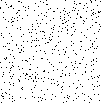
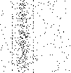

# 14 &ndash; Can't find the forest for the trees

Well... that was a weird one, and I'm not entirely sure I appreciate it.

The first part was pretty simple, just a case of multiplying velocity by time, and judicious use of the modulo operator.

Part 2, though... definitely a head-scratcher. A not-insignificant amount of time spent just staring at the puzzle, trying to figure out what on Earth it was asking me to do. What on earth is a "picture" of a Christmas tree? What is that "most" doing in there? How am I supposed to code for this?

Ultimately, I just decided that, if it was asking for a "picture", then there was nothing else to do, but visualise it. So I threw something together to generate the first 1000 iterations as [PBM files](https://en.wikipedia.org/wiki/Netpbm), and then flicked through them in an image viewer hoping something would jump out at me.

It was pretty quickly clear that, yes, there were features that were jumping out. While most of the images just looked like random static:

however, every now and again, there'd be a clearly visible horizontal or vertical stripe:

 

Scrolling forward, the horizontal stripe seemed to recur every 103 frames, while the vertical stripe would recur every 101 frames. This makes sense, as these are the dimensions of the grid... every 101 frames, the x coordinate of every robot returns to the same place, so the vertical stripe appears again.

And so, it stands to reason that when _both_ these conditions align, that's when the magic might happen. Worth checking out, anyway. So I plugged both of the offsets into the [Chinese remainder theorem](https://en.wikipedia.org/wiki/Chinese_remainder_theorem) and generated that frame, and hey bingo, there it is:

So, ultimately, the puzzle was solveable, but I'm not sure I appreciated the vague description of the question... even if what they're looking for is pretty clear, once you have the answer.

Anyway, there was one silver lining... after yesterday's fiasco with the matrix inversion, I decided to finally get myself a proper toolbox module that I can import into all of my puzzle solutions. I scrounged up a bunch of random utils that I had lying around from past projects, including some Vector/Matrix classes (which had to be upconverted from Py2) and some assorted number-theory utils (some of which are redundant to functions that are already in `math`)... but one of them just happened to be a Chinese remainder theorem function. So it felt nice to have that available, and then immediately be able to put it to use.

[191/51]
