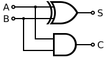
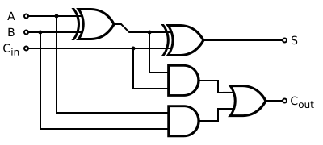

# 24 &ndash; Adders can be venomous

Today's lesson, which I keep being taught and never learn, is to read the whole puzzle statement before diving in too deep. In particular, today, it's to read _what form the output needs to be in_ because that might give some hints as to how to proceed.

Part 1 was fairly straightforward. We loop through the input program, and evaluate it on the available inputs. I was far too lazy to do a proper dependency resolution, so if I come across a rule which we don't have the inputs for yet, I just stash it away for later, and repeatedly loop until they're all done. Not the most efficient, and if part 2 had turned out to be something that required evaluating a lot of different inputs, then I'd have to come up with something better, but I considered that unlikely at this stage of the event, and I was right.

Part 2, stumped me for a bit. At first, I just printed out the list of rules, in a slightly more useful order, and tried to crack into them by hand. They are in a pretty reasonable pattern that wasn't too hard to work through. But it was time-consuming. I did find a line that was incorrect, but it wasn't until the 5th full-adder I got through, it had already taken me several minutes to get that far, and there are 45 separate adder modules here. No, I'd need to come up with something automated.

That work wasn't wasted, though, as I got a good feel for what the shape of the problem was. As described in the puzzle statement, the entire network is supposed to be a big adder, in my case adding two 45-bit numbers to give a 46-bit output. In more specific though, what the network actually _is_, is a single half-adder, and 44 full-adders, chained together, in exactly the way one is taught in a computer engineering class.

To be more specific, that's one half-adder, which looks like (diagrams [borrowed from Wikipedia](https://en.wikipedia.org/wiki/Adder_(electronics)#/media/File:Half_Adder.svg)):



In our case, the `A` and `B` lines are `x00` and `y00`, and `S` is our output, `z00`. `C` is the carry-out, which connects to the first full-adder (which is a larger adder circuit so that it can accept a carry-in).

In our network, that looks like:

```
x00 XOR y00 -> z00
x00 AND y00 -> cout
```

But this is a special-case that only appears for the very first adder, all of the rest of them are full-adders. And I'd already verified both of these lines by hand, they were fine, so I didn't bother analysing them further in my code, I just skipped over them, and focused my efforts on the full-adders.

Those full-adders, by contrast, look like:



In our case, the `A` and `B` lines are our inputs, eg `x01` and `y01`, and the `S` line is our output, eg `z01`. There are then three lines internal to the circuit, and the `Cin` and `Cout` lines, which are the carry that connects each circuit to the next, and these all have random nonsense names in our network that we need to identify. So these five gates end up looking in our network like:

```
x01 XOR y01 -> aaa
aaa XOR cin -> z01
x01 AND y01 -> bbb
aaa AND cin -> ccc
bbb OR ccc -> cout
```

Now, here's the trick: we know the network we have is faulty, but we know that the fault is with the _output_ of each of the gates. The _inputs_ of each gate, and what _type_ of gate it is, are all perfectly reliable. And each of the five gates here are all recognisable from just the inputs. We have an `XOR` gate and an `AND` gate that are connected to the `x`/`y` inputs, and an `XOR` gate, an `AND` gate and an `OR` gate connected to internal inputs. That means we can identify what all of those inputs are _supposed_ to be, to a limited extent... if an internal wire appears in an `XOR` and an `AND`, we know it's supposed to be either the output of the first `XOR`, or a carry signal. Meanwhile if a wire appears in an `OR`, then it it's supposed to be the outputs of one of the two `AND` gates.

So if we have any wires where its position as an output doesn't match its position as inputs, then that's somewhere to start looking.

In theory, this isn't guaranteed to find everything... like, if we were to swap the outputs of `aaa` and `cout` in that sample, this method wouldn't be able to spot it. But it should be a start. I code it up, and run it, and luckily it works and outputs all 8 anomalies.

Now comes the part where I should have read the puzzle more carefully... at this point, I am actually done. Because the puzzle only wants me to enter as a solution the 8 anomalies, in alpha order. But I'm sure I need to also identiy _which_ of those 8 anomalies are paired together... so I dig into the network and identify the 4 pairs. This probably takes a few minutes, as I need to dig into enough context for each one to figure out what output it's attached to, and what that output _should_ be, so I can pair them up. And it's only after I finish doing this, that I look to see how I need to format my answer and see that the pairing doesn't actually matter.

Eh, still got points for it though.

[191/41]
