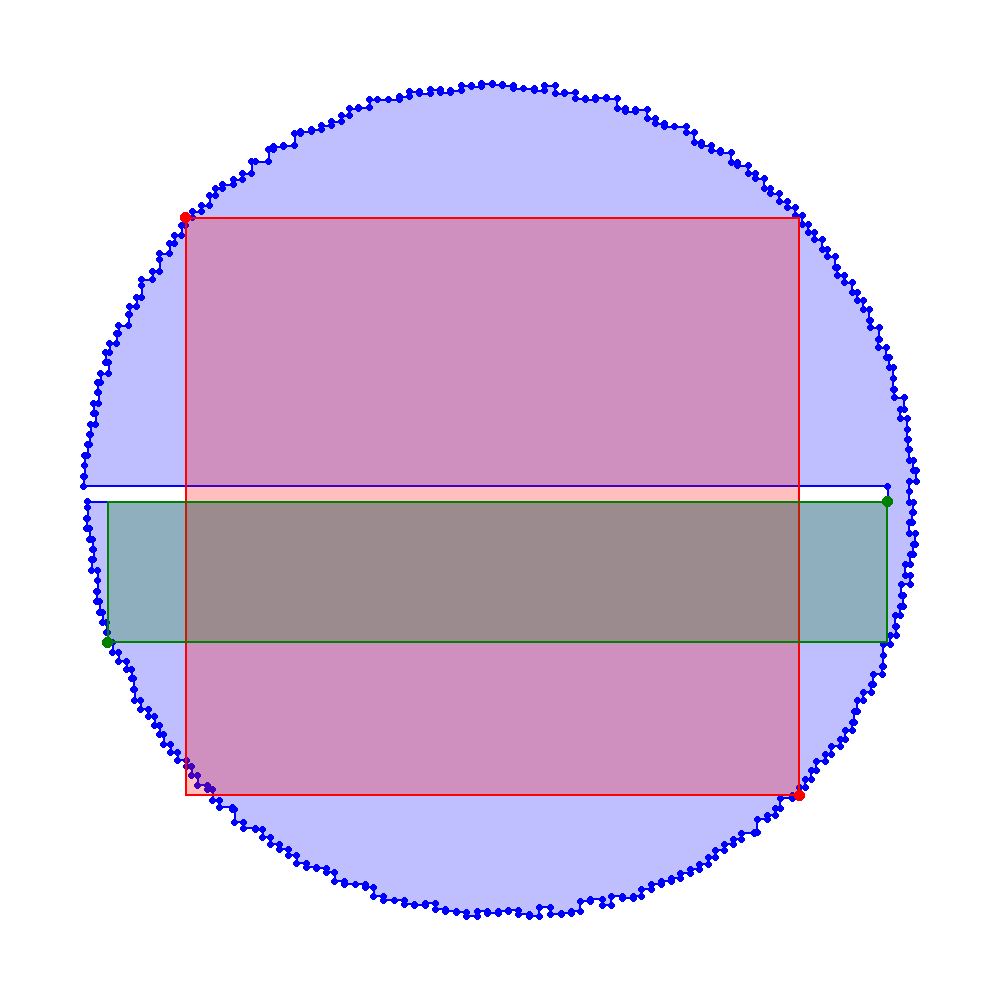
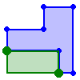

# 9 &ndash; Burning Ring of Fire

I made a couple of errors with my plan this one, and surprisingly neither of them came to bite me, and only figured it out afterwards.

OK, so part one is pretty trivial, just try each pair of points and find the maximum. Technically I'm doing twice as much work as necessary because I'm not even bothering to de-dupe the points for ordering (so I check each pair of points twice, in each orientation), because it's so trivial that it wasn't really worth figuring that out.

Part 2, however, is a lot more complicated.

Getting immediate flashbacks to past puzzles ([a couple years ago](../2023/10.md)) that trying to determine whether a given point is "inside" an arbitrary loop is... entirely doable, but far from trivial. Nevertheless, I was not looking forward to implementing that again. Plus, I knew from the magnitude of the part 1 answer, that a simple algorithm of "check every point inside the rectangle to see if it's inside the loop" would not be feasible.

At first I was considering that the only points I'd need to check in the rectangle to see if they were also inside the loop, would be ones that were around edges. Or at the very least, ones that shared an `x` coordinate with a vertical edge, or shared a `y` coordinate with a horizontal edge. That would reduce it down to a much more reasonable number of points to test, but it would still be a bunch of work, and there were potential edge cases around everything, and I'd still have to actually write the point-test.

Part of this involved splitting the loop into horizontal and vertical edges. It was pretty quick to verify that the loop alternated between horizontal and vertical... there were no traps where it would go rightwards to a point and then continue rightwards to another point, every point was a true corner. However, the first edge in my puzzle data was vertical, while the first edge in the sample data is horizontal, so to make my life easier I rotated the list of points in the sample data by one step, to bring them both back in line.

But I realised, that obviously the only way a rectangle could cross over to outside was if there was _some_ edge that intersected with the rectangle, that's a necessary condition. But is it also a sufficient condition? Well, in general, no, you could have a grid that looks like:
```
................
.#XXXXX##XXXXX#.
.X.....XX.....X.
.X.....XX.....X.
.X.....XX.....X.
.X.....XX.....X.
.##.#XX##XX#.##.
..X.X......X.X..
..X.#XXXXXX#.X..
..X..........X..
..#XXXXXXXXXX#..
................
```
The largest rectangle that's entirely covering interior tiles is the entire top half of the grid, even though that crosses some edges of the loop... because there's two edges right next to each other, there's no gap between them. (NB: the puzzle description for 2023 day 10 explicitly calls out that two edges back-to-back like this still counts as a gap, but for today's puzzle it would not).

So since I knew it would make my life a lot easier if it were true, I did a check to see if there were any cases like this in the puzzle input. Went for a much easier-to-check condition to see if there were any pairs of points that were in neighbouring rows or columns, at all. And I didn't find any, so I had a sigh of relief and moved on with the plan that a rectangle was bad iff it intersected with an edge anywhere. And checking if a line intersects a rectangle (especially when both the line and the rectangle are axis-aligned) is a simple condition to check.

This was, however, my first mistake, as I later discovered I'd messed up... when I did that search for neighbouring points, I did it on the _sample input_, not the actual _puzzle input_. And in my actual puzzle input, there _were_ a handful of points that were in neighbouring columns. I disovered this when I finished implementing the solution, and switched back to the puzzle input to get my final answer, and the `assert` failed. But by that point I was done with the solution, so I just had to cross my fingers, remove the `assert`s and run it anyway, just see if the answer goes through. And luckily it did.

Turns out that while my puzzle did have some points in neighbouring columns, one was at the top of the map and the other was down the bottom, the actual edges aren't back-to-back, so my actual assumption still held, just [my reasoning for assuming it was wrong](https://en.wikipedia.org/wiki/Gettier_problem). Dodged a bullet there.

The second bug, I didn't realise until I was discussing the solution with friends and made a visualisation of what the actual puzzle diagram looked like:



Building this visualisation, I quickly realised (a) this is absolutely a puzzle you could solve very quickly once you knew what shape you were looking at. It only has one major concavity to work around! It's pretty obvious that one corner has to be on the end of that notch, and the other one is somewhere around that side's semicircle. But also, (b) another bug became very obvious when I ran the visualisation on the sample data:



Turns out, I was checking that the rectangle didn't intersect the loop, but I wasn't actually checking it was _inside_, and entirely-_outside_ also counts. However, this rectangle that it found has an area of `24`, and the internal rectangle we are supposed to find is _also_ `24`, so this didn't find a _larger_ rectangle, just an alternate for the same size... which means it still came up with the right answer in the end, and I would have never noticed this bug if I didn't do the visualisation.

Today's puzzle really made me miss the global leaderboard a bit, because that part 2 did end up taking me a while, compared to previous puzzles this year, and I'm very curious to know if it hit everyone else just as hard. But I know it's gone and it's not coming back.

[01:39/14:13]
